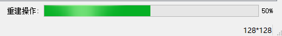

# 多分辨率融合
-----------------------
## 环境准备
- QT: 5.9.8,5.9是长期支持版本,bug较少.
- VS2017 + QT插件
- 在VS2017上进行开发,方便调试.
## 界面设计
- Ribbon风格: Ribbon文件夹是一个Ribbon的demo.

## 使用
- 使用VS2017打开项目文件,进行release编译即可得到.exe可执行文件
## 流程

### 打开图片   
- 点击“单张重建“栏目中的”打开单张二维图片“，打开图片会显示在视图区域。在视图区域，可以用鼠标滑轮进行缩放。这里可以看到，其他“打开图片“按钮变为灰色。
同时，在**融合操作**标签下，只有**三维重建**按钮可以选择。

- 序列图: 打开**低分辨率大孔序列图**。选择该文件夹其中一张图片打开即可，该操作会将该文件夹中所有图片打开。如下图。

### 融合与重建操作
1. 单张重建: 首先打开“单张二维图片”，然后点击“三维重建”。会弹出对话框，选择“保存路径”和“保存图片尺寸“，保存图片尺寸默认是和原图像大小一样大。单击上箭头会成倍增长。右下角进度条显示操作进度。


2. 二维融合三维: 与1相似,最终得到融合后的三维体.
3. 三维融合三维: 出现操作向导，根据向导操作即可,最终得到统计意义等效上的融合模型(孔隙度等指标).

### 取消操作


## 算法简介
### 多尺度岩心图像三维重建算法

1. 输入: 一张训练图像```A```(二值图)    
输出: 重建出一个统计分析意义上等效的三维体```3D_A```.(序列图,长宽高相等)     
注意: 重建出来的三维体并非是实际的三维体,只是统计意义上的三维体.

### 二维融合三维算法

- 二维融合三维
1. 输入: 步骤1得到的```3D_A```(高分辨率局部小孔) + 低分辨率(大孔)的三维体(真实的三维体)```3D_LowRes```(CT二值序列图)    
输出: 将```3D_A```(高分辨率的局部小孔)融合到低分辨率三维体中```3D_LowRes```(序列图).     
注意: 融合之后得到的三维体,大孔是实际上的大孔,融合进去的小孔并非真实的小孔,只是统计等效的小孔.

- 三维融合三维
1. 输入: 高分辨率局部小孔三维体```3D_HighRes```(CT二值序列图,真实结构,较小) + 低分辨率大孔三维体```3D_LowRes```(CT二值序列图,真实结构,较大)        
输出: 将小孔三维体融合进大孔三维体,得到最终的三维体(```3D_LowRes'```)

最终计算参数: 将得到融合后的序列图,放入```3DModelAnalysis```中计算参数.


